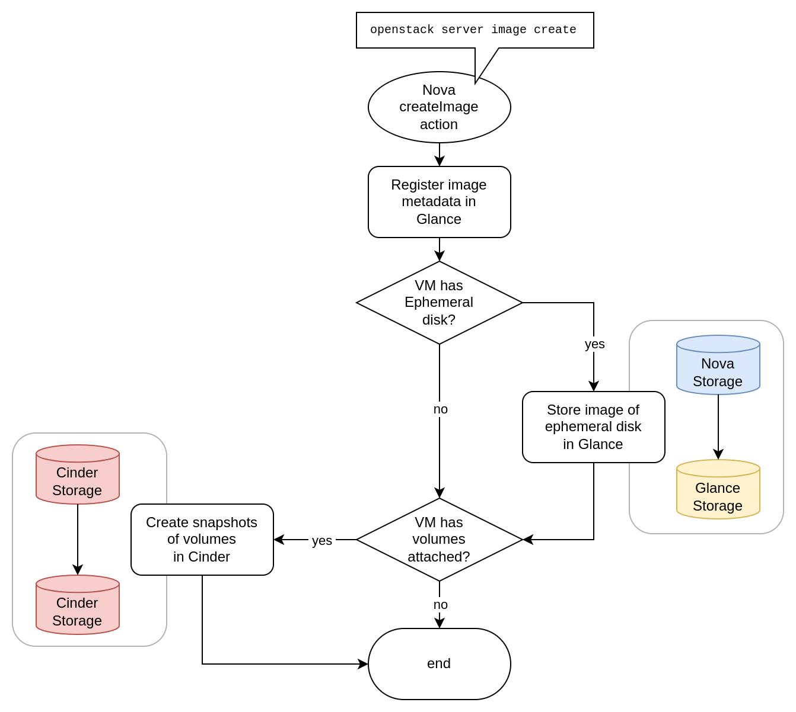

This guide will explain common procedures for creating and restoring backups of user data accumulated in cloud resources such as volumes, images or ephemeral server disks.

## Glossary

| Term              | Explanation                                                                                                                              |
| ----------------- | ---------------------------------------------------------------------------------------------------------------------------------------- |
| Virtual Machine   | Equals the `server` resource in Nova.                                                                                                    |
| Ephemeral Storage | Disk storage directly supplied to a virtual machine by Nova. Different from volumes.                                                     |
| (Glance) Image    | IaaS resource usually storing raw disk data. Managed by the Glance service.                                                              |
| (Cinder) Volume   | IaaS resource representing block storage disk that can be attached as a virtual disk to virtual machines. Managed by the Cinder service. |
| (Volume) Snapshot | Thinly-provisioned copy-on-write snapshots of volumes. Stored in the same Cinder storage backend as volumes.                             |
| Volume Type       | Attribute of volumes determining storage details of a volume such as backend location or whether the volume will be encrypted.           |
| (Barbican) Secret | IaaS resource storing cryptographic assets such as encryption keys. Managed by the Barbican service.                                     |

## Scope

User data in the context of this guide describes data accumulated in cloud resources of a user at runtime.
This concerns primarily storage data of virtual machines stored at at-rest.
This does not cover in-transit or in-use data such as network traffic, virtual machines' RAM contents or IaaS configuration and metadata of cloud resources.

### Overview of applicable User Data

Given the mentioned scope, the following can be classified as user data:

- images stored in Glance
- virtual machine disks, either:
  - Ephemeral Storage stored in Nova
  - volumes stored in Cinder
- encryption keys stored as secrets in Barbican

The following sections will describe backup procedures for each of those resources individually.

## Image backup using download

Glance images may act as backup targets for other resources (such as volumes) but don't have a dedicated backup service for themselves.

When an image is to be backed up, it can be downloaded from the Glance image service and stored outside of the IaaS infrastructure for backup purposes.
In this case it is the user's responsibility to establish the backup procedure and appropriate target storage.

:::caution

When creating images from volumes with a volume type that uses encryption, the resulting image will contain the raw LUKS-encrypted blocks of the volume.
When transferred outside of the IaaS infrastructure, this data is only useful as a backup together with the corresponding encryption key.

Such images can be identified by an attribute called `cinder_encryption_key_id` in the `properties` metadata field of the image.
It only exists for encrypted images and references the encryption key in Barbican.
Refer to the [Barbican secrets section](#barbican-secrets-backup-using-download) for instructions on how to backup the key.

:::

The API or the client may be used to initiate the download, for example:

```bash
openstack image save --file $TARGET_FILE_PATH $IMAGE_NAME_OR_ID
```

This or the underlying API request may be automated as part of a regular backup schedule involving the backup storage target on the user side.

## Ephemeral Storage backup using Glance images

:::caution

When using the `createImage` Compute API action (e.g. via the `openstack server image create` command) on a virtual machine that has volumes attached to it in addition to its Ephemeral Storage disk, the volumes will not be backed up into the image. Instead, a snapshot will be created for each attached volume and referenced in the image metadata. This does not replace genuine volume backups.

See the [corresponding appendix section](#image-creation-action-for-servers-with-attached-volumes) for further details.

:::

Ephemeral Storage disks of virtual machines can be backed up to Glance images easily by using the `createImage` Compute API action or the corresponding client command:

```bash
openstack server image create --name $IMAGE_NAME $SERVER_NAME_OR_ID
```

This will create a Glance image containing a one-to-one copy of the data on the Ephemeral Storage disk at the time of execution.

If the necessity arises to store this backup outside of the IaaS infrastructure, the download procedure as described in [Image backup using download](#image-backup-using-download) may be used after the image creation.

## Volume data backup using Cinder Backup API

The following instructions only apply if the infrastructure offers the Cinder Backup API.

:::note

Backups of volumes using a volume type that uses encryption will retain their encryption and a clone of the original encryption key is created in Barbican linked to the backup.
These backups can only be restored when the Barbican service is available and still has the corresponding copy of the encryption key.

Also, it is advised to take note of the exact volume type when creating a backup of an encrypted volume, because this information will be needed to restore the backup.
See [restoring an encrypted volume backup](#restoring-an-encrypted-volume-backup-cinder-backup).

:::

:::info

It might be difficult or even impossible for a user to transfer backups created by the Cinder Backup API outside of the IaaS infrastructure, depending on the backup backend.
A more easily accessible backup of volumes can be created by using Glance images.
See the [section about volume data backup using Glance images](#volume-data-backup-using-glance-images) for details.

:::

### Backup of detached volumes

Backups can be created using the Cinder Backup API or the corresponding client commands:

```bash
openstack volume backup create $VOLUME_NAME_OR_ID
```

Further backups of the same volume can subsequently be created as incremental backups using the following command:

```bash
openstack volume backup create --incremental $VOLUME_NAME_OR_ID
```

### Backup of attached volumes

:::note

When creating backups of attached (in-use) volumes, the `force` parameter has to be used. These backups capture a state of the full volume at runtime. They will be crash-consistent but not app-consistent.

:::

In case of attached (in-use) volumes, backups can only be created while also specfiying the `force` parameter:

```bash
openstack volume backup create --force $VOLUME_NAME_OR_ID
```

Further backups of the same volume can subsequently be created as incremental backups using the following command:

```bash
openstack volume backup create --force --incremental $VOLUME_NAME_OR_ID
```

## Volume data backup using Glance images

In case the Cinder Backup storage is not available in the IaaS infrastructure, Glance images can be used as a backup target instead.
Such images may also subsequently be downloaded to transfer the backup outside of the IaaS infrastructure.

:::note

Glance image backups of Cinder volumes only allow full backup copies and do not offer incremental or differential backup mechanisms.

:::

### Glance image backups of detached volumes

Volumes not attached to virtual machines can be directly copied into an image.
Such volumes can be identified by their status being `available`.
To backup a detached volume to a Glance image, directly use the corresponding image creation action:

```bash
openstack image create --volume $VOLUME_NAME_OR_ID $IMAGE_NAME
```

After the image creation has finished, a full backup copy of the volume will reside in the Glance storage backend.

If the necessity arises to store this backup outside of the IaaS infrastructure, the download procedure as described in [Image backup using download](#image-backup-using-download) may be used after the image creation.

### Glance image backups of attached (in-use) volumes

Cinder is unable to directly create Glance images from volumes which are attached to virtual machines.
To create backups of such volumes regardless, a detour using volume snapshots can be used which will be described below.

:::note

When creating snapshots of attached (in-use) volumes, the `force` parameter has to be used. These snapshots capture a state of the full volume at runtime. They will be crash-consistent but not app-consistent.

:::

1. Create a snapshot of the target volume while including the `force` parameter in the request:
   - `openstack volume snapshot create --volume $VOLUME_NAME_OR_ID $SNAPSHOT_NAME`
2. Create a new temporary volume based on the snapshot to act as backup source:
   - `openstack volume create --snapshot $SNAPSHOT_NAME $TEMP_VOLUME_NAME`
3. Wait until the volume creation is finished and the temporary volume reaches the `available` status.
4. Create a backup image of the temporary volume:
   - `openstack image create --volume $TEMP_VOLUME_NAME $IMAGE_NAME`
5. Wait until the image creation finishes and the target image reaches the `active` status.
6. Delete the temporary volume and snapshot:
   - `openstack volume delete $TEMP_VOLUME_NAME`
   - `openstack volume snapshot delete $SNAPSHOT_NAME`

A full backup copy of the volume now resides in the Glance storage backend.

If the necessity arises to store this backup outside of the IaaS infrastructure, the download procedure as described in [Image backup using download](#image-backup-using-download) may be used after the image creation.

## Barbican secrets backup using download

:::danger

Secrets downloaded from Barbican will be in plaintext, which means that the secret is unprotected once received from the API.
Before downloading secrets from Barbican make sure that a secure target environment is established for receiving and securely storing the secret's contents.

:::

Barbican secrets can be downloaded in plaintext using the corresponding API or client command:

```bash
openstack secret get --file $TARGET_FILE_PATH --payload_content_type "application/octet-stream" $SECRET_ID
```

:::tip

In case the secret needs to be restored into an OpenStack Barbican later on, it is recommended to also note down the following attributes shown by `openstack secret get $SECRET_ID`:

- Algorithm
- Bit length
- Secret type
- Mode

:::

### Retrieving encryption keys from Barbican

In case of encrypted volumes (i.e. using a volume type with encryption), a corresponding encryption key is stored in Barbican.
When an image is created from such a volume, the encryption key is duplicated in Barbican for the image.
In order to backup those keys, the corresponding secret must first be identified.

For volumes, this is possible starting with the Volume API microversion 3.64:

```bash
openstack volume show --os-volume-api-version 3.64 $VOLUME_NAME_OR_ID
```

The response will contain an `encryption_key_id` field with the ID of the Barbican secret.

For images, the secret reference is stored in the `properties` field instead:

```bash
openstack image show -f value -c properties $IMAGE_NAME_OR_ID
```

In case of images created from encrypted volumes, the resulting output will have a nested `cinder_encryption_key_id` field that contains the ID of the Barbican secret.

The resulting IDs can be used to retrieve the corresponding key using the [Barbican instructions](#barbican-secrets-backup-using-download) above.

:::caution

Note that the key retrieved from the secret is not immediately usable as LUKS passphrase to the image data of the volume.
OpenStack does some processing to the key before it is passed to the LUKS encryption, which must be mimicked accordingly in order to unlock the encryption outside of OpenStack!

See the [example procedure for converting the LUKS key](#luks-encryption-key-conversion-to-decrypt-volume-images) in the appendix section.

:::

## Restore

The following sections will illustrate how to restore the individual resource backups that have been documented above.

### Restoring a backup of a Barbican secret

:::note

Note that restoring a Barbican secret by re-uploading it via the Barbican API will lead to the secret receiving a new ID.
Existing resources referencing an old secret ID cannot make use of the restored copy.

:::

```bash
openstack secret store --algorithm aes --bit-length 256 --mode cbc \
    --secret-type symmetric --file $KEY_FILE_PATH --name $SECRET_NAME
```

Notes:

- Attributes like algorithm, bit length, mode and secret type are not verified by Barbican. Their main purpose is to classify the secret on a metadata level. Make sure to align the attributes with the original secret.
- `$KEY_FILE_PATH` is the local file path of the secret backup as created originally using the [instructions above](#barbican-secrets-backup-using-download).
- `$SECRET_NAME` is entirely optional but helps identifying the restored secret later on and to distinguish it from secrets created by OpenStack itself. It is best to not put whitespace characters in the name, otherwise it has to be surrounded by quotes.

The successful registration of the restored secret can subsequently be verified using:

```bash
openstack secret list --name $SECRET_NAME
```

### Restoring a backup of an unencrypted image

Unencrypted image backups can simply be restored using the regular image upload functionality and specifying the backup file:

```bash
openstack image create --file $IMAGE_FILE_PATH $IMAGE_NAME
```

:::note

In case the original image backup was not based on a volume originally, the image may have had a non-default disk or container format.
In this case, add the command parameters `--container-format` and `--disk-format` to the command accordingly.

:::

### Restoring a backup of an encrypted image

The following section only applies to image backups that were originally created from images of encrypted volumes.

First, restore the corresponding secret of the image using the [instructions above](#restoring-a-backup-of-a-barbican-secret).
The restored secret will receive a new ID in the form of a [UUID](https://en.wikipedia.org/wiki/Universally_unique_identifier).
Note down the ID of the restored secret and insert it in place of `$SECRET_ID` in the command below.

```bash
openstack image create --file $IMAGE_FILE_PATH \
    --property cinder_encryption_key_id=$SECRET_ID \
    --property cinder_encryption_key_deletion_policy=on_image_deletion \
    $IMAGE_NAME
```

The `cinder_encryption_key_deletion_policy` attribute is optional.
If not specified, the referenced secret will not be deleted on image deletion automatically.
In contrast, if set to `on_image_deletion`, the referenced secret will be deleted as soon as the image referencing it is deleted.

### Restoring a volume backup from an image

To restore a volume from an image backup, simply use the volume creation action and specify the image as source.

Depending on whether the original volume the image was created from was encrypted or not, the target volume type might need to be specified accordingly.
Whether this is the case can be identified by inspecting the image's metadata using `openstack image show $IMAGE_NAME_OR_ID` and looking for a "cinder_encryption_key_id" field within "properties".
If it exists, the source volume of the image was encrypted.

To restore the image of an unencrypted volume:

```bash
openstack volume create --image $IMAGE_NAME_OR_ID \
    --size $VOLUME_SIZE_IN_GB $VOLUME_NAME
```

To restore the image of an encrypted volume:

```bash
openstack volume create --image $IMAGE_NAME_OR_ID \
    --type $ENCRYPTED_VOLUME_TYPE \
    --size $VOLUME_SIZE_IN_GB $VOLUME_NAME
```

If restoring an encrypted image, make sure to specify `$ENCRYPTED_VOLUME_TYPE` correctly and have it reference a volume type which also supports the encryption.
Otherwise the volume will be unbootable or unusable by Nova instances.

### Restoring a volume backup from the Cinder Backup service

The Cinder Backup service offers dedicated API actions and commands for restoring volume backups created using the service.
These backups can be restored in one of two ways:

1. Letting the Cinder Backup service create a new volume based on the backup.
2. Overwriting an existing volume with the backup data.

:::note

If the volume backup was originally created from a volume that used a non-default encrypted volume type, letting Cinder Backup create a new volume for backup restoration does not work and the volume type must match exactly.
In such case provision an empty volume with the correct type first and then restore the backup onto it [as explained further down](#restoring-an-encrypted-volume-backup-cinder-backup).

:::

#### Restoring to a new volume (Cinder Backup)

```bash
openstack volume backup restore $BACKUP_NAME_OR_ID $TARGET_NAME
```

... where `$TARGET_NAME` is the desired name of the new volume to be created.
Make sure that no volume with this name already exists.
The Cinder Backup service will create the volume with the same size as the backup indicates.

#### Restoring on an existing volume (Cinder Backup)

As an alternative to creating a new volume as the restore target, the backup can also be restored on an existing volume:

```bash
openstack volume backup restore --force $BACKUP_NAME_OR_ID $VOLUME_NAME_OR_ID
```

... which will overwrite the data on the existing volume, regardless of whether it is empty or not!

The volume will enter the "restoring-backup" state temporarily and will return to the "available" state again once the restore process has finished.

#### Restoring an encrypted volume backup (Cinder Backup)

When restoring a volume backup of a volume that was using a non-default encrypted volume type, a new volume of that type needs to be created first and then the backup restored onto it.
Otherwise, the restoration will fail with the target volume ending up in the "error_restoring" state.
For this procedure to succeed it is necessary to know the exact volume type of the volume the backup was created from.

If the source volume of the backup still exists, the original volume type can be determined by inspecting the backup's `volume_id` attribute and then using it to look up the corresponding volume and its `type` attribute.
The following client command can be used for this (fill in the value for `BACKUP_ID`):

```bash
export BACKUP_ID=...

SOURCE_VOLUME_ID="$(openstack volume backup show $BACKUP_ID -f value -c volume_id)"
openstack volume show -f value -c type "$SOURCE_VOLUME_ID"
```

This returns the name of the original volume type.
If the source volume does not exist anymore, rely on documentation about the backup to determine the type, if available.

First, create a new empty volume as the restore target and use the backup's `size` metadata attribute to match the size of the volume to the backup:

```bash
openstack volume create --size $BACKUP_SIZE --type $VOLUME_TYPE $TARGET_NAME
```

... where `$TARGET_NAME` is the desired name of the new volume.

Once the volume reaches "available" state, restore the backup onto it:

```bash
openstack volume backup restore --force $BACKUP_NAME_OR_ID $TARGET_NAME
```

The volume will enter the "restoring-backup" state temporarily and will return to the "available" state again once the restore process has finished.

## Appendix

### Image creation action for servers with attached volumes

When the `createImage` action of the Compute API (`openstack server image create`) is used on virtual machines that have at least one volume attached, a snapshot will be created for each attached volume individually and referenced in the resulting image's metadata.

This happens regardless of whether the virtual machine has an Ephemeral Storage disk attached.
In case of an Ephemeral Storage disk, only the Ephemeral Storage is copied into the Glance image as a 1:1 copy.

In case of a virtual machine that has no Ephemeral Storage but only volumes, the `createImage` action leads to a Glance image that only consists of metadata (including the resulting volume snapshot references) but carries no actual binary data.



### LUKS encryption key conversion to decrypt volume images

The volume encryption keys stored in Barbican are not directly used as LUKS passphrases by OpenStack because they are in binary format.
OpenStack converts them to ASCII internally before passing them to the encryption layer.
This behavior needs to be reproduced if a decryption of a volume image is desired outside of OpenStack.

:::danger

The instructions below will expose plaintext data of encryption keys and encrypted volume images.
Make sure to only execute these steps in a secure and trusted environment.

:::

First, download the image:

```bash
openstack image save --file image.raw $IMAGE_NAME_OR_ID
```

Next, inspect the image metadata, determine the reference to the encryption key (`cinder_encryption_key_id` property) and download the encryption key:

```bash
openstack image show -f value -c properties $IMAGE_NAME_OR_ID
# (use the value of `cinder_encryption_key_id` as `$SECRET_ID` below)
openstack secret get --file image.key --payload_content_type "application/octet-stream" $SECRET_ID
```

This will result in the following local files:

- `image.raw` = the raw encrypted image downloaded from Glance
- `image.key` = the LUKS encryption key in binary format (plaintext)

Since OpenStack internally uses Python's `binascii.hexlify()` to convert the binary encryption key before passing it as a passphrase to the LUKS encryption, as a last step this conversion must be mimicked to unlock the encryption:

```bash
python3 -c "import binascii; \
    f = open('image.key', 'rb'); \
    print(binascii.hexlify(f.read()).decode('utf-8'))" \
    | sudo cryptsetup luksOpen ./image.raw decrypted_image
```

The decrypted image is now accessible at `/dev/mapper/decrypted_image`.
Note that this is a live en-/decryption operation on the `image.raw` file.
The image is not converted, the encryption is simply unlocked in-memory using LUKS and dm-crypt until the encryption is closed again.

The `/dev/mapper/decrypted_image` can now be handled like a raw block device (e.g. mounted as a filesystem) or snapshotted in decrypted form.

To close the encryption execute:

```bash
sudo cryptsetup luksClose decrypted_image
```
