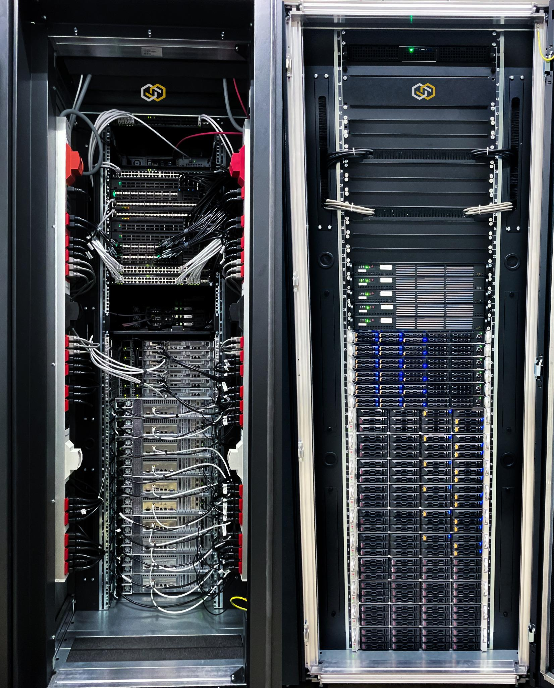

# The SCS Hardware-Landscape

{width=500px}

## General information

The general aim of this environment is to install and operate the SCS reference implementation on hardware.
In addition to the classic tasks in the area of quality assurance, the environment is also used to evaluate
new concepts in the underlay(overlay network area, as a test environment for hardware-related developments,
as a demonstration environment for interested parties and as a publicly accessible blueprint for users.
The environment is designed for long-term use which a varying circle of users.

The environment consists of 21 server and 12 switch components. The selection of hardware and the
functions and properties used was designed so that the focus is on generally available or characteristic
functions and dependency on manufacturer-specific functions is avoided. Instead of the x86 servers or SONiC
switches used here, the realised environment could also be realised with hardware from other manufacturers.

From 1 January 2025, the environment will be operated by [forum SCS-Standards](https://scs.community/2024/10/23/osba-forum-scs-standards/)
and the participating companies.

## Tasks and Objectives

The tasks and objectives of the environments can be summarised as follows:

* The division into several environments makes it possible to run a lab as well as to map a productive environment (near-live operation).
* Operation of the compliance monitor (automated test for conformity with the SCS standards)
* Implementation and validation of the developed standards in a reference environment
* Analysis of problems in the interaction with the standards
* Provision of proof-of-concept installations for interested parties who want to use, promote or further develop the project
* The environment can be used by members of the SCS Standards forum and by contributors to the SCS community
  as a development and test environment for open-source development in connection with the further development
  of the SCS standards, SCS reference implementation and other relevant software components ('open-lab'/'near-live laboratory').
* Continuous Integration Environment ('Zuul as a Service') - Operation of non-critical zuul worker instances

## Installation details

The available hardware was divided into two distinct application areas:

* The **lab environment** consists exclusively of switch hardware used to evaluate, test and develop
  concepts in the area of 'Software Defined Networking'. This means that various switch models can be
  used to test and implement development tasks in the area of the open [SONiC](https://sonicfoundation.dev/) NOS
  (a network operating system based on Debian Linux) or provisioning automation tasks in the SONiC environment with the
  open-source system Netbox, a solution that is used primarily for IPAM and DCIM (IP Address Management, Data Center Infrastructure Management).
* The **production environment** is an exemplary installation of the relevant or most reference implementations with regard to an
  SCS system. It follows a configuration or approach that is based on the needs and circumstances of a real and much larger environment.
  To this end, characteristic infrastructure components were automatically installed on the manager nodes used for the installation.

The setup of the entire environment is designed in such a way that it can be reproducibly restored or reset.
Therefore, the Ansible automation available via OSISM was used in many areas.
Areas that could not be usefully automated using Ansible were implemented using a Python command-line tooling stored in the GIT repository.

## Available documentation

The primary point of information and orientation is the [*readme file*](https://github.com/SovereignCloudStack/hardware-landscape?tab=readme-ov-file#references)
which is stored at the top level of the [configuration repository](https://github.com/SovereignCloudStack/hardware-landscape).

The relevant **References** section refers here to the individual documentation areas.
