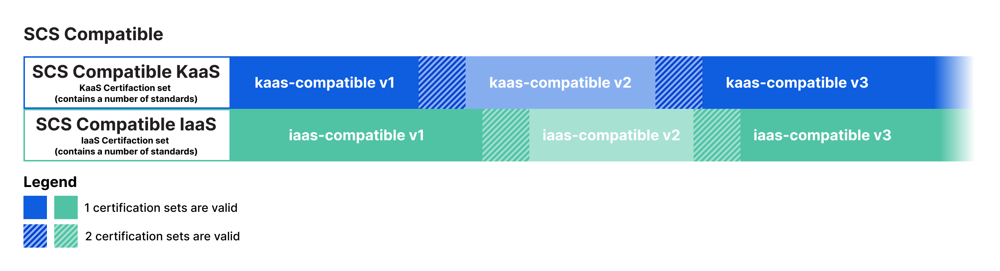

# Scopes and versions

SCS provides a certification framework consisting of six different kinds of certificates of varying scope.
These scopes can be sorted into two dimensions:

1. _certification level_, of which there are three:
   - SCS-compatible
   - SCS-open
   - SCS-sovereign
2. _cloud layer_, of which there are two:
   - infastructure as a service (IaaS)
   - Kubernetes as a service (KaaS)

So, for instance, a certificate can have the scope _SCS-compatible IaaS_ or _SCS-sovereign KaaS_.

Each scope corresponds to a set of standards. As these standards progress, so do the scopes, and we keep track of this by versioning. Each version undergoes a lifecycle of Draft, Stable, and Deprecated, and we aim to keep at most one version stable at the same time, with the exception of a transition period of 4 to 6 weeks.

