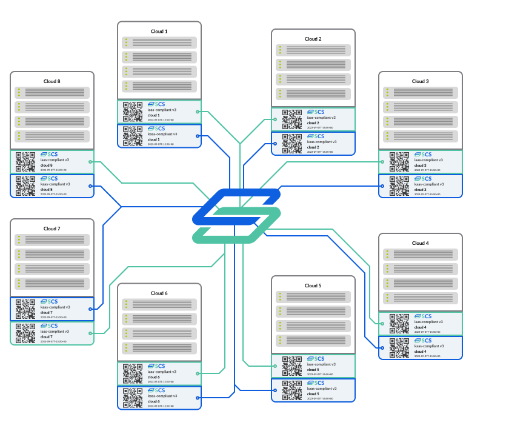

# Introduction

SCS unifies the best of cloud computing in a certified standard. With a decentralized and federated cloud stack, SCS puts users in control of their data and fosters trust in clouds, backed by a global open-source community.

Our Standards emerge within our open community of cloud service providers and individuals with the common aim of meaningful decision that result in less duplicate work and most significantly to enable a federated cloud between cloud service provides based on the Souvereign Cloud Stack.

There are different and versions layers of Standards. Get to know these on our Overview page.

There is also the possibility of getting certified for clouds that fulfill these standards. You will find already ceritified clouds and also how to get certified.
