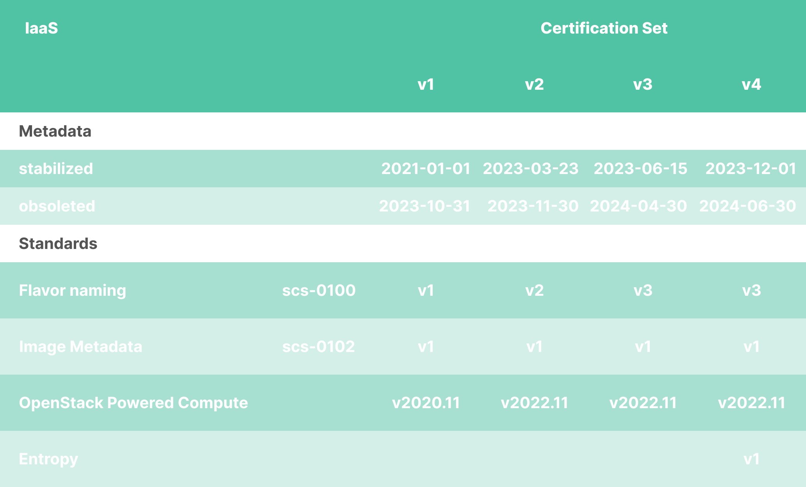

# Overview

Standards are the core deliverable of SCS. By standardizing the open source software components of a cloud computing stack, their versions, how they are to be configured, deployed and utilized SCS guarantees the reproducibility of a certain behavior of this technology.

Standards are also subject of the certification process, which examines their compliance. SCS standards are developed are discussed, developed and maintained in the community by the according teams, which includes naturally the already existing users of SCS.

